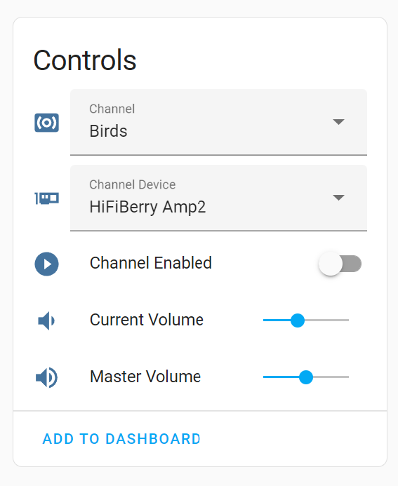

# Amniotic

A multi-output, multi-channel ambient sound mixer for Home Assistant.

Amniotic lets you create on-the-fly custom ambient audio mixes - e.g. mixing Waterfall sounds with Birdsong from one set
of speakers, while playing Fireplace sounds from a second set of speakers in a different room, and so on.

The library integrates with Home Assistant via MQTT as a new device, allowing you to create and control ambient mixes
from the Home Assistant interface.

## Setting Up

### Hardware

Any vaguely suitable device (i.e. with a network connection and audio outputs) should work, but it was primarily
intended for (and developed on) a Raspberry Pi 4B. The lowest spec I've tested on is a Pi Zero W 1, which works fine but
struggled playing more than one Channel at a time.

### Platform

Again any platform should work, but these instructions focus on Raspbian/Debian.

### Dependencies

First you'll need to clone this repository with Git.

```console
git clone https://github.com/fmtr/amniotic.git
```

For Raspbian/Debian, you can just the [install.sh](`install.sh`):

```console
sudo bash install.sh
```

For other platforms, you'll need to install these manually.

Once done, you should find `amnitoic` installed in  `~/.local/bin/amniotic`

### Adding Audio Files

Amniotic uses multiple Channels you can mix together. Channel here doesn't mean speaker channel (e.g. left and right)
but a certain theme of ambient sounds (e.g. Birdsong or Rain). Behind each channel is a directory on disk containing
audio files for that theme.

Since this version needs local audio files (steaming integration will need to wait for a later release), you'll need to
put them on the target machine. The default path is `~/.local/share/amniotic` (which you can change in the config file,
see below).

A valid directory structure consists of subfolders representing ambient sound themes (Channels), each containing a flat
set of individual audio files representing that theme. Here's an example of what the structure should look like:

- `~/.local/share/amniotic`
    - `Birdsong`
        - `Wren at Dawn.mp3`
        - `Starling in Trees.mp3`
        - ...
    - `Rainfall`
        - `Rain in forest.m4a`
        - `Downpour on tent.mp3`
        - ...
    - `Fireplace`
        - `Roaring wood stove (loopable).mp3`

#### Formats

Since Amniotic uses VLC bindings, it should support any format VLC does. But probably safest to stick to simple audio
formats, MP3, M4A etc. I don't know what will happen if you use videos files, etc.!

### Config File

You will need to add a config file at the path `~/.config/amniotic/config.yml`. It's primarily for adding your MQTT
credentials. A commented example file that you can modify is [`config.example.yml`](config.example.yml).

### Running

You should now simply be able to run `~/.local/bin/amniotic`, which will connect to MQTT:

```console
2022-05-20 15:14:51 INFO  amniotic.mqtt    : Amniotic 0.0.1 has started.
2022-05-20 15:14:51 INFO  amniotic.mqtt    : Amniotic 0.0.1 starting MQTT...
2022-05-20 15:14:51 INFO  amniotic.mqtt    : Attempting to connect to MQTT "homeassistant.local:1883": Connection successful
```

### Installing as a Service

Since a dedicated Amniotic device functions like an appliance, you might want to install as a service, so that restarts,
running on boot etc., are handled automatically.

- Copy the service unit file [`amniotic.service`](amniotic.service) to `~/.config/systemd/user/amniotic.service`
- Enable the service: `systemctl --user enable amniotic.service`. The service should now start automatically on each
  boot.
- If you want to start immediately: `systemctl --user start amniotic.service`
- And to stop: `systemctl --user stop amniotic.service`
- To view service logs: `journalctl --user --unit amniotic.service`

## Home Assistant

With MQTT connected, Amniotic will announce itself as a new device to Home Assistant, and in the frontend you'll see
device controls like this:



Each subdirectory from the audio directory set up above will show up as a Channel in the frontend, and when that channel
is enabled the individual files will be played in "Shuffle"
mode.

Switching between Channels with the Channel pull-down, you'll be able to enable/disable each one, set their relative
volume and their output devices etc.

Since these controls are exposed as Home Assistant entities, you can also define and play custom mixes from scenes,
scripts, automations, etc. - and anything else Home Assistant will allow.