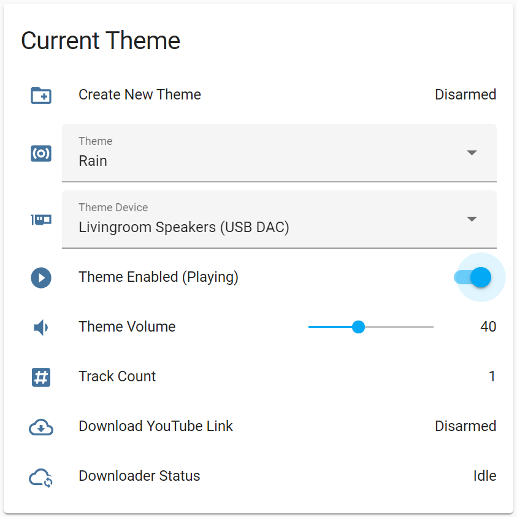
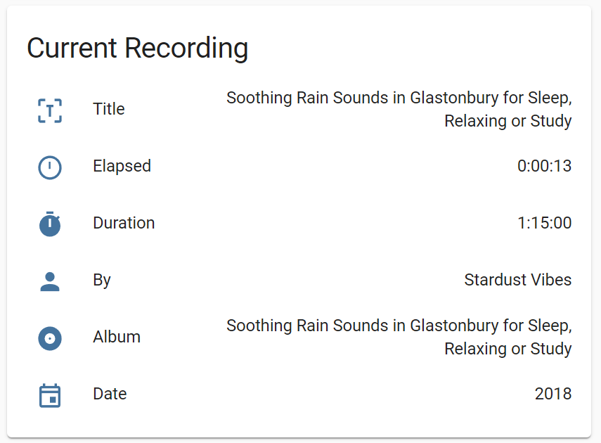

# Amniotic

A multi-output ambient sound mixer for Home Assistant.

Amniotic lets you use a single device to create on-the-fly, custom ambient audio mixes - e.g. mixing Waterfall sounds
with Birdsong on one set of speakers, while playing Fireplace sounds from a second audio device - to suit your tastes
and environment.

The library integrates with Home Assistant via MQTT as a new device, allowing you to create and control ambient mixes
from the Home Assistant interface.

### Why Would I Want Such a Thing?

I won't explain the general reasons for introducing non-musical sounds into one's environment, but if you
find [sound masking](https://en.wikipedia.org/wiki/Sound_masking) helps you concentrate in noisy environments, if
you're (as I am) slightly [misophonic](https://www.webmd.com/mental-health/what-is-misophonia), if you
use [white noise machines](https://en.wikipedia.org/wiki/White_noise_machine) to induce sleep or relaxation, or if you
just think sound is an important factor in setting a pleasant ambience, then you might find Amniotic useful.

### Can't I do This with Spotify, Volumio, HifiBerry etc.?

Since those systems are intended for music, they aren't designed for playing or mixing multiple streams simultaneously
with a single device, even if set up in multi-room configurations. Also, the streaming services often won't allow a
single account to play multiple streams, even _if_ multiple devices are used.

Anyway, these it was these limitations that motivated me to create this library.

## Installing

### Hardware

Any vaguely suitable device (i.e. with a network connection and audio outputs) should work, but it was primarily
intended for (and developed on) a dedicated Raspberry Pi 4B. The lowest spec I've tested on is a Pi Zero W 1, which
works fine but struggled playing more than one Theme at a time. And obviously you'll have better results with better
audio equipment (amps, speakers, etc.), especially for lower-frequency themes.

### Platform

Raspbian/Debian are best tested and covered here. But for other platforms etc., see
the [Other Ways to Run](#Other Ways to Run) section.

### Installing  on Raspberry Pi (Linux)

To install on Raspbian, or any Debian Linux etc., first install dependencies, then the Amniotic package:

```console
apt update -y
apt install -y python3-pip vlc
pip3 install amniotic
```

Once done, you should find `amnitoic` installed in  `~/.local/bin/amniotic`

### Config File

You will need to add a config file at the path `~/.config/amniotic/config.yml`. It's primarily for adding your MQTT
credentials. A commented example file that you can modify is [`config.example.yml`](config.example.yml).

### Running

You should now simply be able to run `~/.local/bin/amniotic`, which will connect to MQTT:

```console
2022-05-20 15:14:51 INFO  amniotic.mqtt    : Amniotic 0.0.1 has started.
2022-05-20 15:14:51 INFO  amniotic.mqtt    : Amniotic 0.0.1 starting MQTT...
2022-05-20 15:14:51 INFO  amniotic.mqtt    : Attempting to connect to MQTT "homeassistant.local:1883": Connection successful
```

### Installing as a Service

Since a dedicated Amniotic device (e.g. a Pi) functions like an appliance, you might want to install as a service, so
that restarts, running on boot etc., are handled automatically.

- Copy the service unit file [`amniotic.service`](amniotic.service) to `~/.config/systemd/user/amniotic.service`
- Enable the service: `systemctl --user enable amniotic.service`. The service should now start automatically on each
  boot.
- If you want to start immediately: `systemctl --user start amniotic.service`
- And to stop: `systemctl --user stop amniotic.service`
- To view service logs: `journalctl --user --unit amniotic.service`

## Home Assistant

With MQTT connected, Amniotic will announce itself to Home Assistant, and in
the [Devices section of the frontend](http://homeassistant.local:8123/config/devices/dashboard) you'll see a new device
with controls like this:

<figure><figcaption>Theme Controls</figcaption></figure>

Since these controls and sensors are exposed as Home Assistant entities, you can also define and play custom mixes from
scenes, scripts, automations, etc. - and anything else Home Assistant will allow.

## Themes

Amniotic uses multiple Themes you can mix together. Theme here just means a certain theme of ambient sounds (e.g.
Birdsong or Rainfall) made up of individual tracks within that Theme.

When that theme is enabled, via the controls above, the individual files will be looped in "Shuffle"
mode. Switching between Themes with the Theme pull-down, you'll be able to enable/disable each one, set their relative
volumes and their output devices etc., and the sensors will update to provide information about the current track.

<figure><figcaption>Sensors Showing Track Information</figcaption></figure>


There are two ways to add Themes:

- The easier way: Create new Themes, and populate them with YouTube links, via the Home Assistant interface.
- The more manual way: Copy audio files (e.g. MP3) to the host device directly.

### Creating Themes via Home Assistant

When running for the first time, you'll have a single theme called **Default Theme**. You can add new Themes by clicking
the **New Theme** control, and entering a name.

<figure><figcaption>Creating a New Theme</figcaption></figure>

> ℹ️ Home Assistant does not seem to provide a simple text box control.
> So things that require text input (i.e. providing the name for a Theme, etc.) need
> to use an alarm panel code entry box, which works but looks a bit weird.
> I hope Home Assistant provides a proper text box entity in the near future.

The Theme can then be populated by clicking Download YouTube Link, and entering the link to an ambient sound video.
Amniotic with then split the audio channel from the video and download it into your Theme.

<figure><figcaption>Populating a Theme from a YouTube Link</figcaption></figure>

> ℹ️ Why YouTube?

### Adding Audio Files Manually

You can also just manually copy audio files to the machine running Amniotic. The default path
is `~/.local/share/amniotic` (which you can change in the config file, see above).

Here's an example of what the structure should look like:

- `~/.local/share/amniotic`
    - `Birdsong`
        - `Wren at Dawn.mp3`
        - `Starling in Trees.mp3`
        - ...
    - `Rainfall`
        - `Rain in forest.m4a`
        - `Downpour on tent.mp3`
        - ...
    - `Fireplace`
        - `Roaring wood stove (loopable).mp3`

#### Audio Formats

Since Amniotic uses the [Python VLC bindings](https://wiki.videolan.org/python_bindings), it should
support [any format VLC does](https://wiki.videolan.org/VLC_Features_Formats/#Audio_Codecs). But probably safest to
stick to simple audio formats, MP3, M4A etc. I don't know what will happen if you use videos files, etc.!

### Updating

Amniotic also exposes its updater to Home Assistant, so newer versions can be installed from there. Updating will
restart automatically and the device will reappear running the latest version, so all quite seamless.

<figure><figcaption>Update Controls</figcaption></figure>

## Other Ways to Run

### Docker Image

There's also a [pre-built Docker Image](https://hub.docker.com/r/fmtr/amniotic) available, so you can run on a NAS or
home server etc. To run in container, use this command to map through sound devices, audio and config files:

```console
docker run --device /dev/snd --volume <local audio path>:/root/.local/share/amniotic --volume <local config path>:/root/.config/amniotic/ fmtr/amniotic:latest
```

### Other Platforms

Installing on **Windows** using `winget` will look (roughly) like this:

```powershell
winget install -e --id Python.Python.3
winget install -e --id VideoLAN.VLC
pip3 install amniotic
```

Installing on **macOS** using `brew` will look (roughly) like this:

```console
brew install python3
brew install --cask vlc
pip3 install amniotic